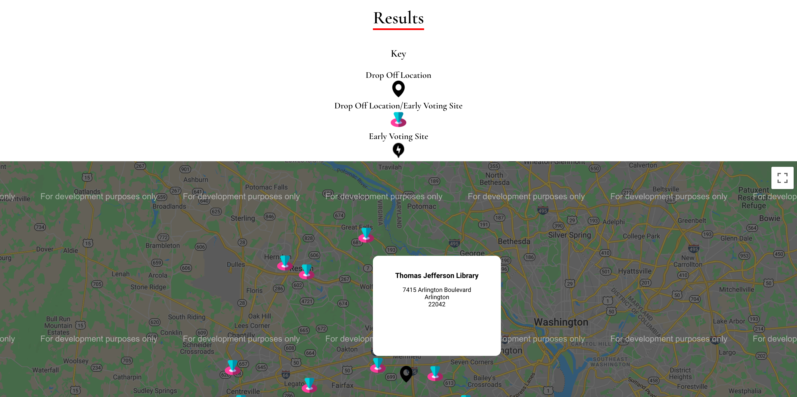

# Every Vote Counts

- Link to app: http://every-vote-counts.vercel.app

## Summary

Every Vote Counts allows you to find voting information near an address you input, as well as other information. In order to do this, you create an account and then log in. If one would like to save an address, one may save up to 5.

## Screenshots

- Homepage (not logged in)
  

- Homepage (logged in)
  

- Create Account Page
  

- Get Info Page
  

- Results Page
  

- Location information displayed on results page
  

- Other information displayed on results page
  

- Saved addresses page
  

## Technology

The PERN stack is used for this app.

### Client Side:

React is used, with a heavy implementation of react-router-dom. Contexts and services are used to facilitate functionality for the page. Two Google APIs are used, the Civic Information API and the Maps API. They are used in tandem to provide a detailed account of voting information near the address entered.
